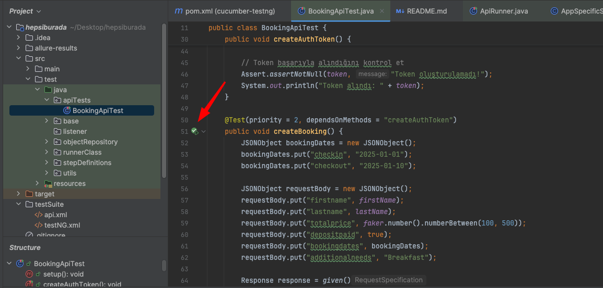

## Hakkında

POM (Page Object Model) ile oluşturulmuş Cucumber BDD test otomasyon frameworkudur.

-  Senaryolar cucumber feature file'lar içerisinde yazılır ve her step için stepdefinitionlar içerisinde tanımlanır.

-  Feature file içerisinde yazılan senaryolar non-teknik takım arkadaşlarınında anlayacağı şekilde bdd ye uygun yazılır.

-  Sık kullanılan stepler mümkün oldukça parametrik yazılarak kod tekrarından kaçınılmıştır

-  Otomasyon bilgisi olmayan takım arkadaşlarına da kısa bir aktarımla bu framework üzerinde case yazmaları ve otomasyona katkıda bulunmaları sağlanabilir.

-  Proje içinde kullanılacak genel metotlar AutomationMethods içerisinde tanımlanmış ve stepDefinitionlara extend edilmiştir.

-  WebElementler objectRepository içerisinde bir json dosyasında json formatında saklanarak getLocatorFromJson metodu ile locatora çevrilirek kullanılır. Bu yapı, kodu daha parametrik kullanmaya yardımcı olur. 

## Api Testleri
Api için yazılan testler apiTest dosyası içinde yer alır. RestAssured kullanılarak yazılmıştır.

## Run
Çalıştırmak için testNG.xml dosyasına sağ click run yapabilirsiniz.
Api testlerini çalıştırmak için api.xml sağ click run yapabilirsiniz. Tek tek çalıştırmak isterseniz BookingApiTest sınıfı içeirsinden ilgili testlerin yanında yer alan run butonları ile çalıştırabilirsiniz.

## Raporlama
Test sonuçlarını görüntülemek için allure report entegre edilmiştir. Bilgisayarınıza allure kurulumu yaptıktan sonra, test koşumları tamamlandığında
terminalden "allure serve" komutunu çalıştırdığınızda rapor ekranı browser üzerinden açılacaktır

## Örnek test koşumu videosu
Aşağıdaki linki browserda açarak örnek test koşum videosunu görebilirsiniz.
https://jam.dev/c/92a60215-abc4-47c4-a97f-116358cdbeba